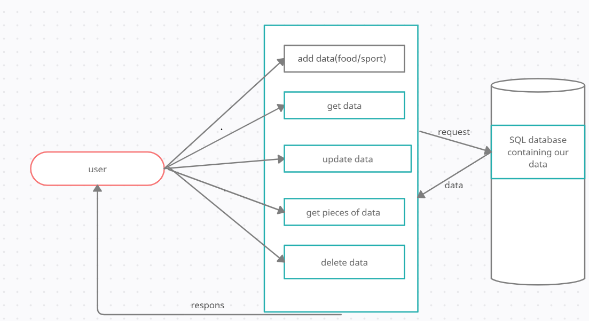

# basic-api-server

## heroku:https://basic-api-server-marwan.herokuapp.com/
## pull_request:https://github.com/marwanrawshedh/basic-api-server/pull/1

## on lab 401-03 i built the structure as that written in the lab guideline and it is similar like what we did in previos lab as a structure.
## I installed all the dependencies(dotenv ,express,jest,supertest,sqlite3,sequelize,pg)
## after that I built the server from scratch and I made the index.js as a starting point and it is working after the data base work by using async function.
## then i created two modal as it is required (food ,sport).
## i created two route files (food,sport )
## after that I built the test files server, logger. validator, as it is required, Assert the following
- 404 on a bad route.
- 404 on a bad method.
- The correct status codes and returned data for each REST route.
- Create a record using POST.
- Read a list of records using GET.
- Read a record using GET.
- Update a record using PUT.
- Destroy a record using DELETE.

## before the deployment I tested my code and everything went fine.
## finally I did ACP and merged dev branch with main branch.
## and regarding heroku deployment i did as it is required i added the config var.
